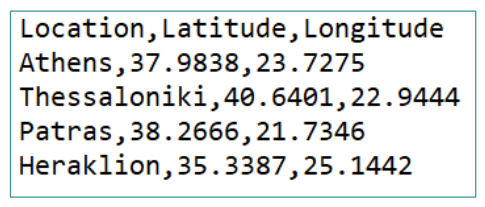
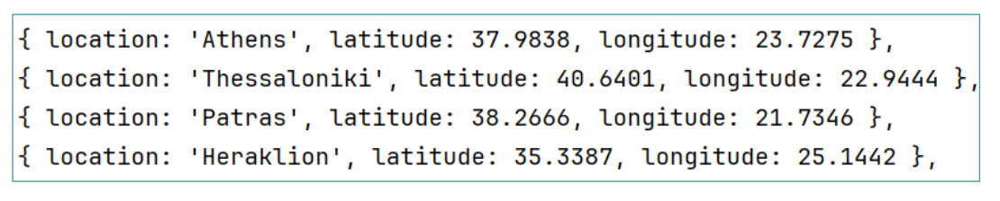

**Locations**  

Έστω ένα αρχείο locations.txt με τοποθεσίες, latitude και longitude. Αναπτύξτε ένα
πρόγραμμα που να διαβάζει και να γράφει σε ένα άλλο αρχείο με το συγκεκριμένο format.

Input

Output

**Αντιγραφή Binary**

Θα δοθεί την επόμενη εβδομάδα. Προσπαθήστε!

